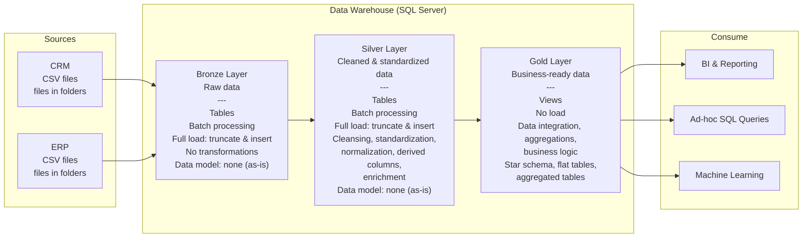

# Southline Cycles: Data Warehouse Architecture

To view the diagram, paste the block below into https://mermaid.live (GitHub renders it automatically).

```mermaid
flowchart LR
    subgraph Sources
        CRM["CRM<br/>CSV files<br/>files in folders"]
        ERP["ERP<br/>CSV files<br/>files in folders"]
    end
    subgraph DW["Data Warehouse (SQL Server)"]
        B["Bronze Layer<br/>Raw data<br/>---<br/>Tables<br/>Batch processing<br/>Full load: truncate & insert<br/>No transformations<br/>Data model: none (as-is)"]
        S["Silver Layer<br/>Cleaned & standardized data<br/>---<br/>Tables<br/>Batch processing<br/>Full load: truncate & insert<br/>Cleansing, standardization,<br/>normalization, derived columns,<br/>enrichment<br/>Data model: none (as-is)"]
        G["Gold Layer<br/>Business-ready data<br/>---<br/>Views<br/>No load<br/>Data integration, aggregations,<br/>business logic<br/>Star schema, flat tables,<br/>aggregated tables"]
    end
    subgraph Consume
        BI["BI & Reporting"]
        SQL["Ad-hoc SQL Queries"]
        ML["Machine Learning"]
    end
    CRM --> B
    ERP --> B
    B --> S --> G
    G --> BI
    G --> SQL
    G --> ML
```
